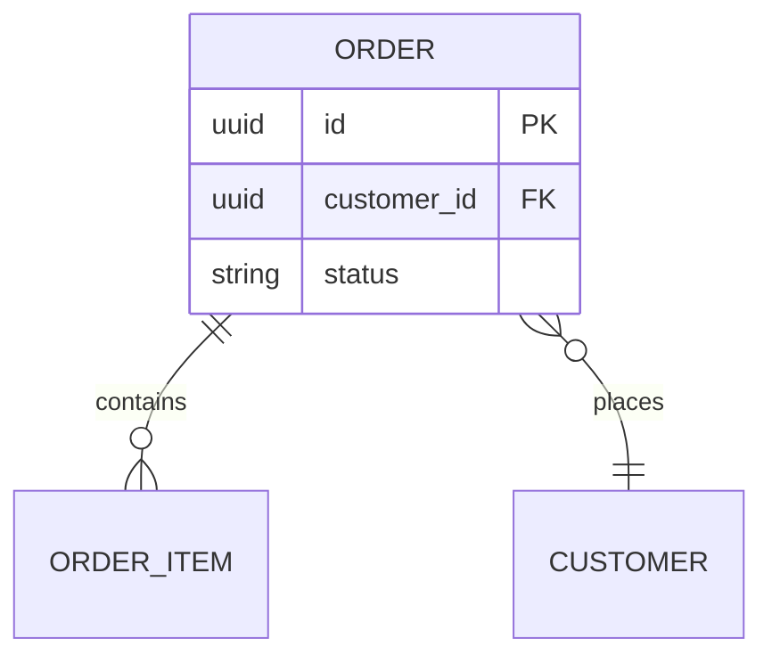

# Draw.io ERD (schema → entity-relationship diagram)

Build an ERD **from real schema sources** in the repo, write a `.drawio`, open in **draw.io Desktop**. Local-only.

Depends on the sibling **`drawio`** skill.

## Resolve helpers

```bash
DRAWIO_SKILL="${HOME}/.cursor/skills/drawio"
```

Read `$DRAWIO_SKILL/xml-reference.md` and `$DRAWIO_SKILL/mermaid-reference.md` as needed.

## Discover schema sources (first match wins unless user points elsewhere)

| Stack | Look for |
|-------|----------|
| Prisma | `schema.prisma`, `prisma/schema.prisma` |
| Drizzle | `schema.ts`, `**/schema/*.ts` with `pgTable` / `sqliteTable` |
| TypeORM / MikroORM | `*.entity.ts` |
| SQLAlchemy | `models.py`, `**/models/*.py` |
| Django | `models.py` |
| Rails | `db/schema.rb`, `app/models` |
| Raw SQL | `*.sql` migrations, `schema.sql` |
| Protobuf / GraphQL | only if user asked for those models as entities |

Read the files. Extract **entities**, **fields** (name + type), **PKs**, **FKs / relations**.

## Authoring

**Prefer Mermaid `erDiagram`** when relations are standard and Desktop CLI is available:



Convert:

```bash
drawio -x -f xml -o docs/architecture/orders-erd.drawio orders-erd.mmd
```

Delete the `.mmd` after conversion.

**Use XML** when you need precise cardinality notation, colors, or layout control. Entity = swimlane or table-like stack:

- Header cell: entity name (`fontStyle=1`)
- Rows: `field: type` with PK/FK markers
- Relations: edges with labels `1`, `0..*`, `exactly 1`, etc.
- Style edges `endArrow=ERzeroToMany;startArrow=ERmandOne` when appropriate (draw.io ER arrows), or simple labeled orthogonal edges if unsure

Optional layout:

```bash
drawio -x -f xml --layout horizontalFlow -o erd.drawio erd.drawio
```

## Naming & output

- File: `<domain>-erd.drawio` or `data-model.drawio`, prefer `docs/architecture/` when it exists
- Use **real table/model names** from the schema
- Show important columns (PK, FK, money/status/timestamps); omit noisy audit columns unless asked
- Note unmapped or inferred relations in the chat, not as fake FKs

## Open

Desktop only (`open -a "draw.io" <file>` on macOS). Print absolute path.

## Hand-offs

- Architecture (services, queues) → `drawio-from-code`
- Patch existing ERD → `drawio-update`
- Export PNG for README → `drawio-docs`
